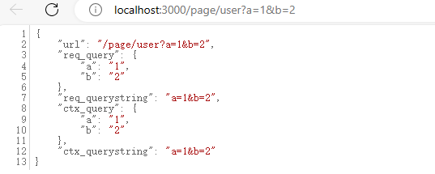

# GET请求数据获取

## 使用方法
在koa中，获取GET请求数据源头是koa中request对象中的query方法或querystring方法，query返回是格式化好的参数对象，querystring返回的是请求字符串，由于ctx对request的API有直接引用的方式，所以获取GET请求数据有两个途径。
- 1.是从上下文中直接获取
    - 请求对象ctx.query，返回如 { a:1, b:2 }
    - 请求字符串 ctx.querystring，返回如 a=1&b=2
- 2.是从上下文的request对象中获取
    - 请求对象ctx.request.query，返回如 { a:1, b:2 }
    - 请求字符串 ctx.request.querystring，返回如 a=1&b=2

## 举个例子

demo源码

[https://github.com/ChenShenhai/koa2-note/blob/master/demo/request/get.js](https://github.com/ChenShenhai/koa2-note/blob/master/demo/request/get.js)

### 例子代码
```js
const Koa = require('koa');
const app = new Koa();

app.use(async (ctx) => {
  const url = ctx.url;

  // 从上下文的request对象中获取
  const request = ctx.request;
  const req_query = request.query;
  const req_querystring = request.querystring;

  // 从上下文中直接获取
  const ctx_query = ctx.query;
  const ctx_querystring = ctx.querystring;

  ctx.body = {
    url,
    req_query,
    req_querystring,
    ctx_query,
    ctx_querystring
  }
})

app.listen(3000, () => {
  console.log('server is running at port 3000');
});
```

### 执行程序
执行后程序后，访问 [http://localhost:3000/page/user?a=1&b=2](http://localhost:3000/page/user?a=1&b=2) 会出现以下情况
> 注意：我是用了json格式化插件才会显示json的格式化


