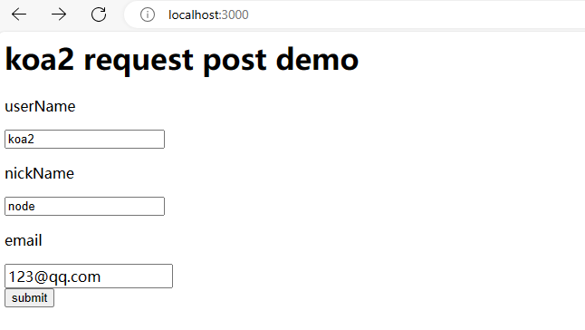
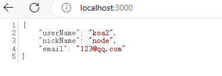

# POST请求参数获取

## 原理
对于POST请求的处理，koa2没有封装获取参数的方法，需要通过解析上下文context中的原生node.js请求对象req，将POST表单数据解析成query string（例如：`a=1&b=2&c=3`），再将query string 解析成JSON格式（例如：`{"a":"1", "b":"2", "c":"3"}`）

> 注意：ctx.request是context经过封装的请求对象，ctx.req是context提供的node.js原生HTTP请求对象，同理ctx.response是context经过封装的响应对象，ctx.res是context提供的node.js原生HTTP响应对象。

> 具体koa2 API文档可见 [https://github.com/koajs/koa/blob/master/docs/api/context.md#ctxreq](https://github.com/koajs/koa/blob/master/docs/api/context.md#ctxreq)

### 解析出POST请求上下文中的表单数据

[demo](./example/post/index.js)

```js
const parsePostData = ctx => {
  return new Promise((resolve, reject) => {
    try {
      let postData = ''
      ctx.req.addListener('data', (data) => {
        postData += data
      })
      ctx.req.addListener('end', () => {
        const parseData = parseQueryStr(postData)
        resolve(parseData)
      })
    } catch (err) {
      reject(err)
    }
  })
}

const parseQueryStr = queryStr => {
  let queryData = {}
  let queryStrList = queryStr.split('&')
  for (let [index, queryStr] of queryStrList.entries()) {
    let itemList = queryStr.split('=')
    queryData[itemList[0]] = decodeURIComponent(itemList[1])
  }
  return queryData
}
```

## 举个例子

### 例子代码
```js
const Koa = require('koa')
const app = new Koa()

const parsePostData = ctx => {
  return new Promise((resolve, reject) => {
    try {
      let postData = ''
      ctx.req.addListener('data', (data) => {
        postData += data
      })
      ctx.req.addListener('end', () => {
        const parseData = parseQueryStr(postData)
        resolve(parseData)
      })
    } catch (err) {
      reject(err)
    }
  })
}

const parseQueryStr = queryStr => {
  let queryData = {}
  let queryStrList = queryStr.split('&')
  for (let [index, queryStr] of queryStrList.entries()) {
    let itemList = queryStr.split('=')
    queryData[itemList[0]] = decodeURIComponent(itemList[1])
  }
  return queryData
}

app.use(async (ctx) => {
  if (ctx.url === '/' && ctx.method === 'GET') {
    // 当GET请求时候返回表单页面
    ctx.body = `
      <h1>koa2 request post demo</h1>
      <form method="POST" action="/">
        <p>userName</p>
        <input name="userName" /><br/>
        <p>nickName</p>
        <input name="nickName" /><br/>
        <p>email</p>
        <input name="email" /><br/>
        <button type="submit">submit</button>
      </form>
    `
  } else if (ctx.url === '/' && ctx.method === 'POST') {
    // 当POST请求的时候，解析POST表单里的数据，并显示出来
    ctx.body = await parsePostData(ctx)
  } else {
    // 其他请求显示404
    ctx.body = '<h1>404!</h1>'
  }
})

const server = app.listen(3000, () => {
  console.log('server is running at port 3000...')
})
```

### 启动例子

### 访问页面


### 提交表单发起POST请求结果显示

