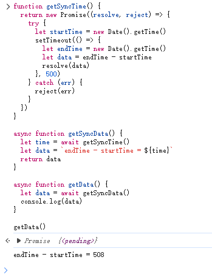

# async / await 使用

## 快速上手理解

先复制以下这段代码，在粘贴在chrome的控制台console中，按回车键执行

```javascript
function getSyncTime() {
  return new Promise((resolve, reject) => {
    try {
      let startTime = new Date().getTime()
      setTimeout(() => {
        let endTime = new Date().getTime()
        let data = endTime - startTime
        resolve( data )
      }, 500)
    } catch ( err ) {
      reject( err )
    }
  })
}

async function getSyncData() {
  let time = await getSyncTime()
  let data = `endTime - startTime = ${time}`
  return data
}

async function getData() {
  let data = await getSyncData()
  console.log( data )
}

getData()
```

### 在浏览器的console中执行结果如下


### 从上述例子可以看出 async/await 的特点：
- 可以让异步逻辑用同步写法实现
- 最底层的await返回需要是Promise对象
- 可以通过多层 async function 的同步写法代替传统的callback嵌套


# koa2 中的 async / await 使用

## 举个栗子

- Promise封装 fs 异步读取文件的方法

```javascript
// code file:  util/render.js
// Promise封装 fs 异步读取文件的方法
const fs = require('fs');

const render = (page) => {
  return new Promise((resolve, reject) => {
    const filePath = `./view/${page}`;
    fs.readFile(filePath, 'binary', (err, data) => {
      if (err) {
        reject(err);
      } else {
        resolve(data);
      }
    })
  })
}

module.exports = render;
```

- koa2 通过async/await 实现读取HTML文件并执行渲染

```javascript
// code file : index.js
// koa2 通过async/await 实现读取HTML文件并执行渲染
const Koa = require('koa')
const app = new Koa()

const render = require('./util/render')

app.use(async (ctx) => {
  ctx.body = await render('index.html')
})

app.listen(3000)
console.log('[demo] start-async is starting at port 3000...')
```
